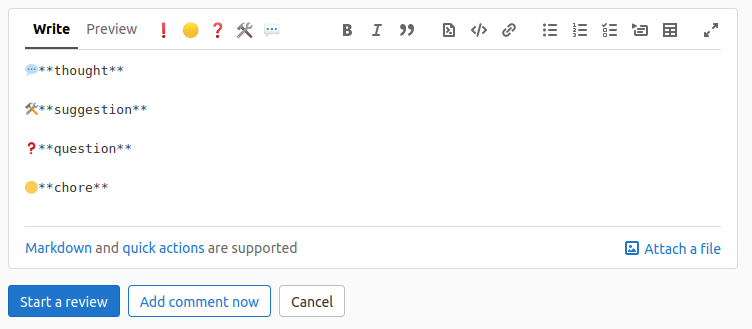

# Gitlab Conventional Comments

Adds hotkeys for commonly used Conventional Comments types to the comment box in the gitlab
https://conventionalcomments.org/

Compatible with Firefox and Chrome

## How to use

- clone the repository
- open `manifest.json` and edit `matches` option to your gitlab url.

### Chrome

- [load unpacked extension in google chrome's extensions settings](https://developer.chrome.com/docs/extensions/mv3/getstarted/#manifest)
  - Open the Extension Management page by navigating to chrome://extensions
  - Enable Developer Mode by clicking the toggle switch next to Developer mode.
  - Click the Load unpacked button and select the extension directory.

### Firefox

- Open the Extension Management page by navigating to about:addons
- Click "Debug addons" in the dropdown menu
- Click "Load Temporary Add-on..."
- Select `manifest.json` in the extension directory

# License

MIT
